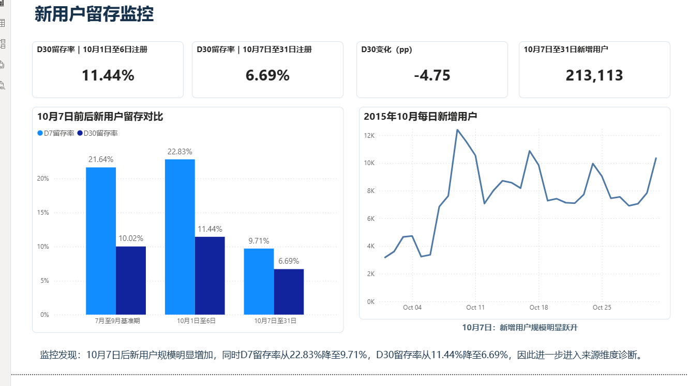
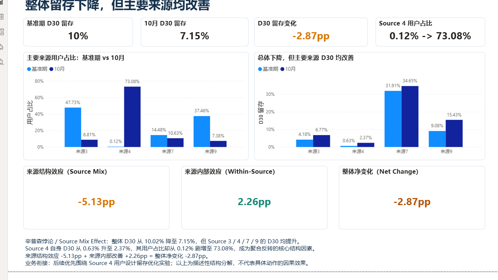

# KKBox 新用户留存异动分析与增长诊断

> KKBox New User Retention Monitoring & Growth Diagnosis

## 1. 项目背景

本项目围绕“新用户留存为什么突然下降”建立一条完整业务分析链路：

**业务目标 → 指标体系 → 留存监控 → 异动发现 → 数据验证 → Cohort / Source维度下钻 → 辛普森悖论识别 → Source Mix结构分解 → Source 4定位 → A/B实验设计 → Power BI交付**

项目不是流失预测或机器学习项目，也没有真实策略上线、真实实验结果或已实现的留存提升。其价值在于建立监控口径、识别异常、定位问题集中范围，并形成可验证的业务行动方案。

---

## 2. 业务目标

**Objective：**

降低新用户流失，提高长期订阅价值。

**Strategy：**

1. 提升新用户首周持续使用；
2. 识别并优化低质量新增用户来源。

**Measurement：**

以D30留存率作为核心结果指标，以D7留存率和首7天活跃天数作为前置监控指标，并结合行为、来源和交易指标诊断差异。

AARRR仅作为辅助框架：

- **Acquisition：**注册来源和新增用户；
- **Activation：**首周行为；
- **Retention：**D7 / D30；
- **Revenue：**交易、付费和收入；
- 公开数据不支持Referral分析。

---

## 3. 数据说明

项目使用KKBox公开数据中的会员、用户日志和交易数据。

原始行为日志约4.1亿行，覆盖2015-01-01至2017-03-31；留存异常研究聚焦2015年7月至10月注册用户。

基础审计关注：

- 时间覆盖；
- 缺失；
- 重复；
- 负播放时长；
- 不同版本数据的时间边界。

少量`total_secs < 0`记录仅从播放时长累计中排除，日志仍用于活跃天数、完整播放和留存判断。

`is_cancel`不等于churn。

`transactions_v2`及2017年流失标签不用于解释2015年的D30异常；历史`transactions.csv`仅用于构建注册后30天交易与付费特征，辅助验证不同来源的订阅结构差异。

---

## 4. 指标体系

- **核心结果指标：**D30留存率；
- **前置监控指标：**D7留存率、首7天活跃天数；
- **行为诊断：**首7天播放时长、首7天完整播放次数；
- **来源诊断：**`registered_via`、新增用户数、来源占比；
- **订阅诊断：**30天交易率、付费率、自动续费率、30天收入。

D7 / D30均定义为注册后第7 / 30天当天存在活动日志；观察窗口不足的用户从相应分母排除。

---

## 5. Step 1 指标监控与异常发现

按注册月份监控新用户D7 / D30后发现：

- 7月至9月基准期D30为**10.02%**；
- 10月全月D30降至**7.15%**；
- 同时10月新增用户规模明显增加。

**异常定义：**

2015年10月新用户留存明显下降，同时新增用户规模增加，因此触发异动分析。

---

## 6. Step 2 数据质量验证

依次检查：

- 日志日期完整性；
- D7 / D30观察窗口；
- 用户重复；
- user-date重复；
- 指标独立复现；
- 注册量日趋势；
- 日志断流风险。

**结论：**

未发现日志缺失、观察窗口不足、重复记录或指标口径问题，留存下降可视为真实分析异常。

---

## 7. Step 3 维度拆解

### 时间维度

| 注册区间 | 新增用户 | 日均新增 | D7 | D30 |
|---|---:|---:|---:|---:|
| 10月1日至6日 | 22,771 | 3,795 | 22.83% | 11.44% |
| 10月7日至31日 | 213,113 | 8,525 | 9.71% | 6.69% |

异常断点集中在**10月7日前后**。

### 来源维度

`registered_via`是匿名注册来源代码，公开数据没有官方渠道映射。

来源4占比从：

- 7月至9月基准期：**0.12%**
- 10月1日至6日：**0.59%**
- 10月7日至31日：**80.83%**

10月7日至31日来源4用户达到**172,259**，D7为**5.09%**，D30为**2.37%**。

留存下降与来源4大规模进入在时间上高度同步。

### 行为维度

来源4用户：

- 首7天活跃天数：**1.99**
- 首7天播放秒数：**8,306.93**
- 首7天完整播放：**27.17次**
- 首次活动覆盖率：约**90.60%**

因此，来源4并非无法产生首次活动，其主要特征是：

> **首次活动后的首周持续使用深度较弱。**

---

## 8. Step 4 原因假设

- **H1：**10月7日后大量低留存来源4用户进入，是整体留存下降的主要结构性解释；
- **H2：**来源4用户首周持续使用深度较弱，与低留存表现相关；
- **H3：**来源4用户交易、付费和自动续费结构较弱，说明其订阅质量与其他主要来源存在明显差异。

---

## 9. Step 5 假设验证

- **H1：支持；**
- **H2：部分支持；**
- **H3：部分支持。**

来源4的30天订阅表现：

- 30天交易率：**3.23%**
- 付费率：**3.09%**
- 平均30天收入：**10.86**
- 自动续费率：**0.51%**

这些结果确认不同来源之间存在明显的行为、留存和订阅结构差异，但不构成严格因果关系。

### 辛普森悖论与来源结构效应分解

10月整体D30由基准期的**10.02%**下降至**7.15%**，变化为**-2.87 pp**。但按注册来源下钻后，主要来源内部的D30全部提高：

| Source | Baseline D30 | October D30 | D30变化 |
|---:|---:|---:|---:|
| 3 | 4.18% | 6.77% | +2.59 pp |
| 4 | 0.63% | 2.37% | +1.74 pp |
| 7 | 31.91% | 34.65% | +2.75 pp |
| 9 | 9.08% | 15.43% | +6.34 pp |

其他小Source同样没有下降。因此出现“**整体指标下降，但所有主要分组内部指标改善**”的严格聚合趋势反转，即**辛普森悖论（Simpson's Paradox）**。

进一步使用10月Source权重与Baseline Source D30构造反事实：

| 项目 | D30 / 贡献 |
|---|---:|
| 7月至9月 Baseline pooled D30 | 10.02% |
| 10月全月 Actual D30 | 7.15% |
| 10月Source结构 + Baseline Source D30的反事实 | 4.89% |
| Source Mix Effect | -5.13 pp |
| Within-Source Effect | +2.26 pp |
| Total Change | -2.87 pp |

> **-5.13 pp + 2.26 pp = -2.87 pp**

固定各Source的Baseline D30，仅替换为10月Source结构，反事实D30降至约**4.89%**。来源结构变化产生显著负向影响，各来源内部改善抵消约**+2.26 pp**，最终观察到**-2.87 pp**的整体下降。

Source 4是理解这次结构反转的核心证据：

- 用户占比：**0.12% → 73.08%**；
- D30：**0.63% → 2.37%**。

Source 4自身D30并没有恶化，而是有所提高；但其绝对D30仍明显低于Baseline整体水平，同时用户权重剧烈扩张，改变了总体用户结构。

> **Source 4用户权重剧烈扩张是聚合留存趋势反转的核心结构因素。**

该分解是**描述性结构归因**，不是营销或产品动作的因果证明。公开数据无法判断Source 4激增具体来自营销投放、渠道策略、产品入口、埋点变化或其他业务动作。

---

## 10. Step 6 根因定位

2015年10月新用户留存下降的主要直接解释因素，是**10月7日以后新增用户来源结构发生剧烈变化**。

来源4在10月7日至31日占新增用户**80.83%**，而该来源用户的：

- 首周使用深度；
- D7 / D30留存；
- 交易表现；
- 付费表现；
- 自动续费表现

均明显弱于同期其他主要来源。

因此，大量来源4用户进入后，结构性拉低了整体新用户留存。

公开数据无法确认来源4在10月7日后的激增究竟来自：

- 渠道投放；
- 产品注册入口调整；
- 用户迁移；
- `registered_via`埋点 / 编码规则变化。

因此，不能擅自将来源4命名为某个具体业务渠道。

---

## 11. Step 7 业务建议

### 第一阶段：业务核查

首先确认异常究竟来自真实新增流量变化，还是数据记录方式变化：

1. 确认`registered_via=4`的真实业务映射；
2. 核对10月7日前后的渠道投放计划；
3. 检查注册入口和产品版本变化；
4. 检查埋点及编码规则变更日志。

优先判断这是：

> **实际新增流量结构变化**

还是：

> **instrumentation / coding change**

### 第二阶段：运营优化

如果确认来源4是真实新增来源，可针对“首次活动后D2–D7持续使用不足”测试：

- D2–D7个性化内容推荐；
- 首周歌单引导；
- D2 / D4回访提醒；
- 基于首次播放内容的二次推荐。

来源4内部首周活跃分层结果：

| 首7天活跃天数 | 用户占比 | D30 |
|---|---:|---:|
| 0–1天 | 51.49% | 0.45% |
| 2天 | 17.69% | 0.89% |
| 至少3天 | 30.82% | 6.43% |

不同首周使用深度用户的D30存在明显梯度。

因此建议将后续运营重点放在：

> **首次活动后的D2–D7持续使用。**

但该结果仍属于观察性相关关系，不能证明“增加首周活跃天数”会因果性提高D30。

---

## 12. Step 8 A/B实验设计

Source Mix分解定位了需要重点处理的人群结构问题，后续以Source 4为目标人群设计随机对照实验，以验证留存优化策略是否能够产生真实增量。

### 项目边界

KKBox项目完成的是**实验上线前设计**。

历史数据没有真实Control / Treatment exposure，因此不报告虚假实验结果。

完整设计与可复现样本量计算见：

`notebooks/06_ab_test_design.ipynb`

历史baseline和流量复核见：

`sql/02_ab_test_planning_validation.sql`

### 实验对象

完成业务映射确认后的来源4新用户。

### 随机化单位

`msno` / user level。

使用用户级而不是session级分流，避免同一用户在不同访问中进入不同实验组造成跨组污染。

### 分流策略

使用`msno`进行稳定Hash取模：

- 50% → Control
- 50% → Treatment

保证同一个用户始终进入同一实验组。

### Control

现有新用户首周体验。

### Treatment

增强首周持续使用策略，例如：

- 个性化首周内容推荐；
- D2 / D4回访触达；
- 基于首次播放内容提供后续推荐。

这些是待验证的产品 / 运营策略，并不是历史数据中已经真实发生的Treatment。

### Primary Metric

**D30 Retention**

用于判断首周持续使用干预是否能够改善较长期的新用户留存。

### Secondary Metrics

- D7 Retention；
- First 7D Active Days；
- Complete Plays。

用于判断Treatment是否首先影响用户早期使用行为。

### Guardrail Metrics

- 30D Revenue；
- Paying Rate；
- Auto-renew Rate等必要的Subscription Health指标。

### 实验数据要求

真实实验系统至少需要记录：

- `user_id / msno`
- `experiment_id`
- `experiment_group`
- `assignment_time`
- `exposure_time`
- `treatment_version`
- post-treatment D7 / D30 outcome
- revenue / subscription outcome

### 统计设计

预设：

- `alpha = 0.05`
- `power = 0.80`
- 双侧检验
- 1:1分流

历史planning baseline：

- 来源4用户：**172,259**
- D30：**2.37085%**
- 历史日均符合条件用户：**6,890.36**

基于0.3、0.5、1.0个百分点三档absolute MDE计算样本量、招募周期和D30成熟窗口。

| Absolute MDE | 每组样本量 | 总样本量 | 招募周期 | 含D30成熟窗口的总日历周期 |
|---:|---:|---:|---:|---:|
| +0.3 pp | 42,823 | 85,646 | 13天 | 43天 |
| +0.5 pp | 15,990 | 31,980 | 5天 | 35天 |
| +1.0 pp | 4,345 | 8,690 | 2天 | 32天 |

样本量采用双侧two-sample proportion test计算。

由于主指标为D30，收满实验样本后不能立即判断最终结果，还需要等待最后一批入组用户完成约30天结果成熟窗口。

现有公开历史数据没有真实treatment exposure，因此本项目仅完成实验上线前设计，不伪造：

- uplift；
- p-value；
- confidence interval；
- statistical significance；
- rollout result。

真正上线后，需要收集Control / Treatment真实实验结果，再进行SRM、显著性检验、置信区间分析和最终上线决策。

---

## 13. Power BI Dashboard

### Page 1：新用户留存监控

回答：

> **什么时候出现问题？**

展示：

- D30前后变化；
- 新增用户量；
- D7 / D30留存对比；
- 每日新增用户趋势。



### Page 2：来源结构与留存诊断

回答：

> **为什么出现问题？**

展示：

- Overall D30下降；
- Major Source D30反向改善；
- Source Mix变化与辛普森悖论；
- Source 4结构变化；
- Source Mix / Within-Source / Net Change分解。



第一页负责**发现异常**，第二页负责**解释异常**。

Power BI定位为：

> **可复用的新用户留存监控与异动诊断看板**

而不是生产级实时自动监控系统。

---

## 14. 技术架构

```text
Raw Logs
   ↓
Pandas chunksize 分块读取
   ↓
用户级 Processed 分析底表
   ↓
MySQL 业务维度聚合与结果复核
   ↓
Power BI 留存监控与来源诊断
```

由于原始行为日志规模较大，采用Pandas `chunksize`分块读取和用户级聚合，避免将全部原始日志一次性载入内存；随后将压缩后的分析底表导入MySQL完成业务聚合和结果复核。MySQL没有直接处理全部4亿行日志。

### Power BI本地数据路径

公开PBIP中的Power Query数据路径使用占位根目录：

`C:\path\to\kkbox_growth_analysis\data\processed\`

复现时先运行Notebook生成processed分析底表，再将`retention_base.tmdl`和`transaction_features.tmdl`中的占位根目录替换为本机项目的`data\processed\`目录，然后在Power BI Desktop中执行Refresh。仓库不包含完整raw或processed数据。

## 15. 分析方法

- **OSM / AARRR：**明确业务目标，并组织Acquisition、Activation、Retention与Revenue指标；
- **Cohort / Retention Analysis：**按注册批次监控D7与D30留存；
- **Anomaly / Segment Analysis：**识别10月异常，并按时间、Source、行为与交易维度下钻；
- **Simpson's Paradox / Source Mix Decomposition：**识别聚合趋势反转，量化结构效应与来源内部效应；
- **LTV / Subscription Analysis：**使用公开交易特征辅助评估订阅价值差异；
- **A/B Testing：**采用用户ID Hash稳定随机分流，并完成MDE、样本量和实验周期测算。

## 16. 数据限制

1. `registered_via`没有官方业务渠道映射，Source 4不能被命名为广告、应用商店或某个具体合作渠道；
2. 辛普森悖论与结构分解是描述性结构归因，不是具体营销或产品动作的因果识别；
3. 当前数据没有真实业务intervention或A/B experiment treatment；
4. `+0.3 pp`是实验设计的目标MDE，不是已实现的留存提升；
5. 项目不报告虚构的uplift、p-value或上线结果；
6. Power BI是分析交付，不是生产级实时监控系统。

## 17. 项目结论

项目从D30监控发现2015年10月异常，经数据质量验证确认其为真实数据现象，再通过Cohort与Source维度下钻发现严格的辛普森悖论：整体D30从**10.02%**下降至**7.15%**，但主要Source内部D30均提高。

Source Mix分解显示来源结构效应为**-5.13 pp**，来源内部改善抵消**+2.26 pp**，净变化为**-2.87 pp**。Source 4自身D30由**0.63%**提高至**2.37%**，但用户占比由**0.12%**剧增至**73.08%**，成为聚合趋势反转的核心结构因素。

因此，后续不应对所有用户平均施策，而应先核查Source 4的真实业务映射与变更背景，再以Source 4用户为目标人群，通过随机实验验证首周激活与留存策略是否能够产生真实增量。
